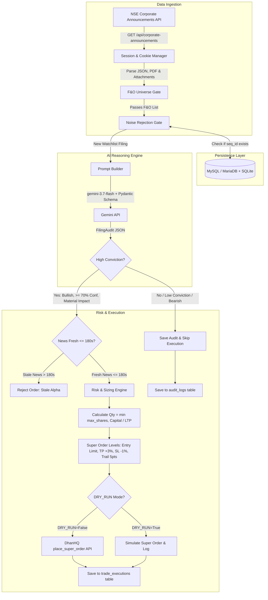
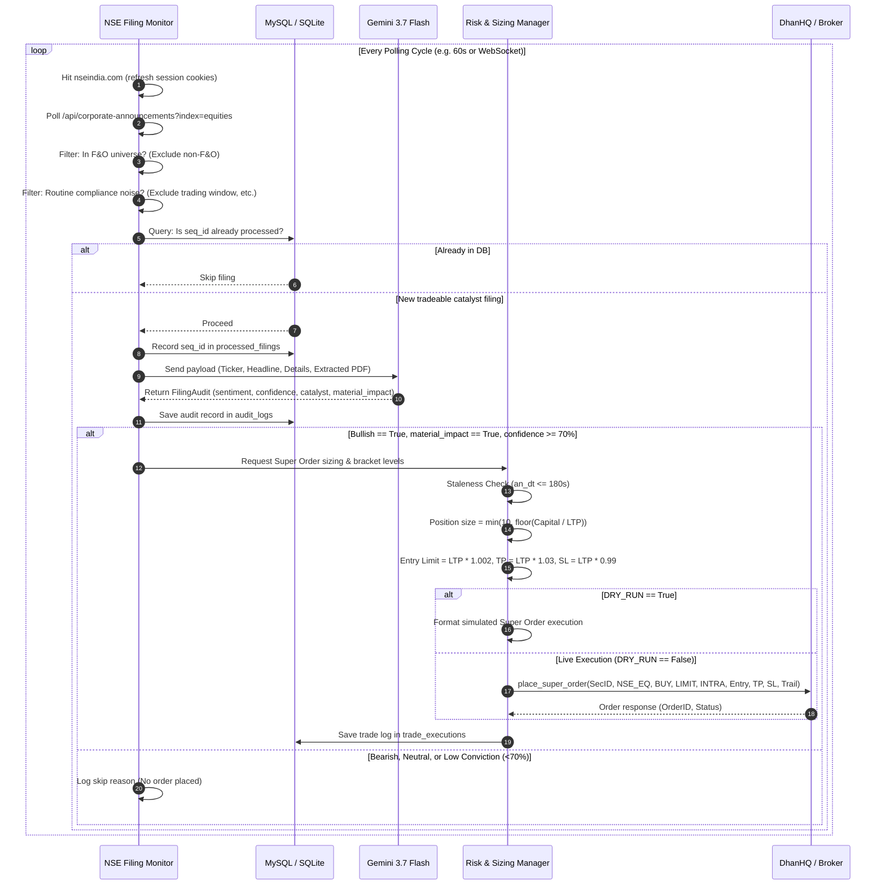

# Implementation Plan: Event-Driven News-Based Trading Strategy

A complete technical blueprint and flow architecture for an event-driven news-arbitrage trading system for Indian equities (**NSE Equities & DhanHQ Broker**), using **Google Gemini 3.7 Flash** for sub-second corporate disclosure evaluation.

---

## 1. System Architecture & End-to-End Flow



---

## 2. Announcement Lifecycle (Sequence Diagram)



---

## 3. Modular Directory Architecture

```text
News_Based_Strategy/
├── .env                              # Credentials and runtime flags
├── .gitignore                        # Git ignore rules
├── implementationPlan.md             # System blueprint and technical design
├── pyproject.toml                    # Build metadata and dependencies
├── README.md                         # Operational and quickstart guide
├── data/
│   └── strategy.db                   # SQLite database fallback
├── src/
│   └── news_based_strategy/
│       ├── __init__.py               # Package metadata and public exports
│       ├── config.py                 # Configuration loader and settings
│       ├── engine.py                 # Strategy orchestrator & cycle manager
│       ├── main.py                   # Application entry point & CLI commands
│       ├── core/
│       │   ├── __init__.py
│       │   └── models.py             # FilingAudit, Announcement, TradeSignal, TradeResult
│       ├── execution/
│       │   ├── __init__.py
│       │   ├── executor.py           # DhanHQ Super Order & regular executor
│       │   └── risk.py               # Position sizing (max 10 shares), Super Order levels
│       ├── ingestion/
│       │   ├── __init__.py
│       │   ├── extractor.py          # Bounded PDF extraction (2 MB / 2 pgs / 3s timeout)
│       │   ├── filter.py             # Noise rejection engine (30+ patterns)
│       │   ├── monitor.py            # NSE poller with cookie priming
│       │   └── universe.py           # Dhan F&O universe sync & SecID resolver
│       ├── intelligence/
│       │   ├── __init__.py
│       │   ├── analyzer.py           # Gemini 3.7 Flash AI reasoning engine
│       │   └── prompts/
│       │       ├── __init__.py
│       │       └── catalyst_prompt.py# Structured prompt template
│       └── storage/
│           ├── __init__.py
│           ├── database.py           # Low-level SQLite helper
│           └── repository.py         # MySQL primary with SQLite fallback
└── tests/
    ├── test_basic.py
    ├── test_core/
    ├── test_execution/
    │   ├── test_executor.py
    │   ├── test_risk.py
    │   └── test_phase3_execution.py
    ├── test_ingestion/
    ├── test_intelligence/
    └── test_storage/
```

---

## 4. Component Responsibilities & Specifications

### Component 1: Ingestion Layer (`monitor.py`, `filter.py`, `extractor.py`, `universe.py`)
* **Cookie Priming & Anti-Scraping**: NSE blocks direct calls to `/api/...`. Session cookies are primed against `https://www.nseindia.com`.
* **F&O Gate**: Rejects non-F&O stocks at zero-cost to ensure all traded tickers have liquid cash and derivative contracts.
* **Noise Filter**: Over 30 deterministic regex patterns reject trading window closures, secretarial audits, investor meetings, loss of share certificates, and credit ratings.
* **Bounded PDF Extractor**: Safely extracts the first 2 pages (max 2 MB) with a 3.0s timeout using `pypdf`.

### Component 2: AI Reasoning Layer (`analyzer.py`, `prompts/catalyst_prompt.py`)
* **Model**: `gemini-3.7-flash` with zero temperature (`temperature=0.0`) for sub-second deterministic responses.
* **Structured Schema**: Enforces strict `FilingAudit` Pydantic schema:
  - `sentiment`: `"BULLISH"`, `"BEARISH"`, or `"NEUTRAL"`
  - `confidence`: Integer between `0` and `100` (Gate: $\ge 70\%$)
  - `catalyst_type`: e.g. `ORDER_WIN`, `EARNINGS_BEAT`, `RESIGNATION`, `PENALTY`
  - `material_impact`: Boolean (True if expected rapid movement $\ge 1.5\%$)
  - `summary`: 1-sentence plain English rationale

### Component 3: Storage & State Persistence (`repository.py`)
* **MySQL Primary** (`mysql.gb.stackcp.com:44677`):
  1. `processed_filings`: Stores `(seq_id, symbol, an_dt, processed_at)` for durable deduplication across restarts.
  2. `audit_logs`: Stores all AI audits (`sentiment`, `confidence`, `catalyst_type`, `material_impact`, `summary`).
  3. `trade_executions`: Stores all trade attempts (`symbol`, `action`, `quantity`, `product_type`, `order_id`, `remarks`, `dry_run`).
* **SQLite Fallback**: Automatically activates if MySQL connection is unavailable.

### Component 4: Risk & Execution Layer (`risk.py`, `executor.py`)
* **Trigger Condition**:
  $$\text{Trigger} = (\text{sentiment} \in \{\text{BULLISH}, \text{BUY}\}) \land (\text{confidence} \ge 70) \land (\text{material\_impact} = \text{True})$$
* **Sizing Formula (Max 10 shares)**:
  $$\text{Quantity} = \min\left(\text{max\_shares\_per\_trade}, \max\left(1, \left\lfloor \frac{\text{Capital}}{\text{LTP}} \right\rfloor\right)\right)$$
* **Super Order (Bracket Order) Mechanics**:
  - **Product**: `INTRADAY` (Strictly enforced by Dhan for Super Orders)
  - **Order Type**: `LIMIT`
  - **Entry Limit**: $\text{round}(\text{LTP} \times (1 + \text{slippage\_buffer\_pct} / 100), 1)$ (0.2% buffer)
  - **Profit Target**: $\text{round}(\text{LTP} \times (1 + \text{target\_profit\_pct} / 100), 1)$ (+3.0%)
  - **Stop Loss**: $\text{round}(\text{LTP} \times (1 - \text{stop\_loss\_pct} / 100), 1)$ (-1.0%)
  - **Trailing Jump**: `5.0 points`
* **Staleness Circuit Breaker**: Rejects filings whose exchange timestamp is older than `180s`.

- Build `StrategyEngine` event loop with graceful interrupt handling (`Ctrl+C`).
- Add unit tests for models, storage, monitor parsers, and mock order executions.

