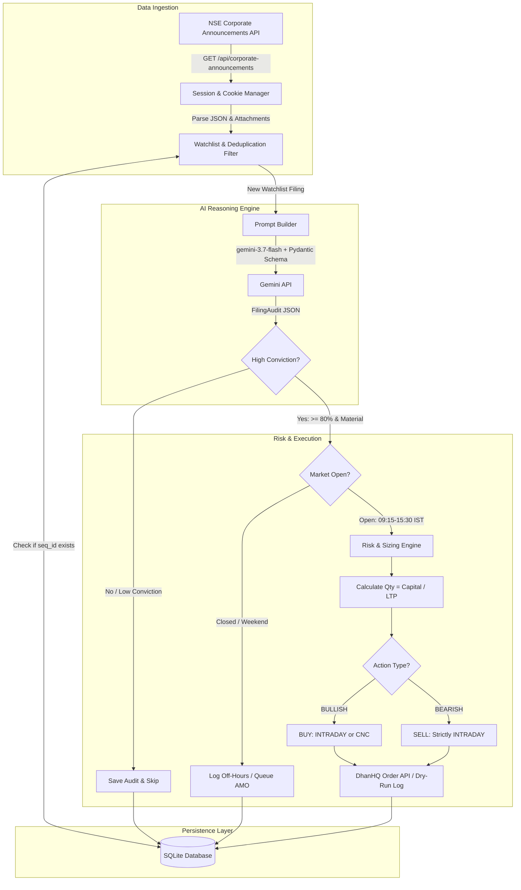
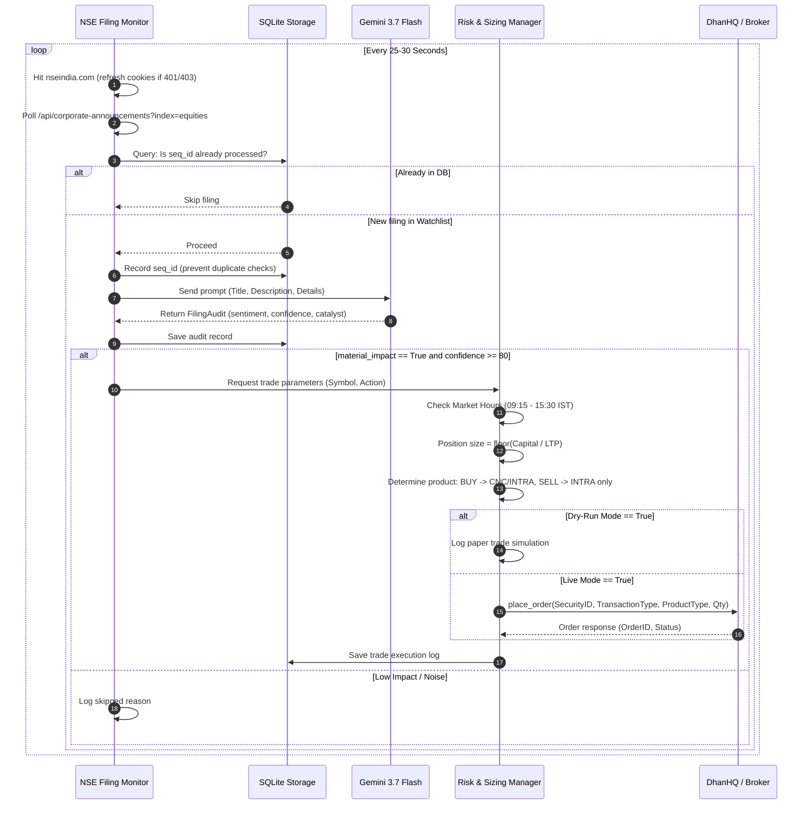

# Implementation Plan: Event-Driven News-Based Trading Strategy

A complete technical blueprint and flow architecture for an event-driven news-arbitrage trading system for Indian equities (**NSE Equities & DhanHQ Broker**), using **Google Gemini 3.7 Flash** for sub-second corporate disclosure evaluation.

---

## 1. System Architecture & End-to-End Flow



---

## 2. Announcement Lifecycle (Sequence Diagram)



---

## 3. Modular Directory Architecture

```text
News_Based_Strategy/
├── .env                              # Credentials and runtime flags (ignored by git)
├── .env.example                      # Template with variable explanations
├── .gitignore                        # Python, SQLite, virtualenv, and secrets rules
├── implementationPlan.md             # This document
├── pyproject.toml                    # Build metadata and dependencies
├── requirements.txt                  # Core runtime dependencies
├── README.md                         # Quickstart and operational guidelines
├── data/
│   └── strategy.db                   # SQLite database for deduplication and audit trail
├── src/
│   └── news_based_strategy/
│       ├── __init__.py               # Package metadata and exports
│       ├── config.py                 # Configuration loader and risk parameters
│       ├── models.py                 # Pydantic schemas (FilingAudit, Announcement, etc.)
│       ├── monitor.py                # Resilient NSE corporate announcements poller
│       ├── analyzer.py               # Gemini 3.7 Flash structured reasoning client
│       ├── storage.py                # SQLite persistence (deduplication & trade logs)
│       ├── executor.py               # Dhan order execution, margin check, & dry-run simulator
│       ├── engine.py                 # Strategy orchestrator & polling event loop
│       └── main.py                   # Application entry point & CLI commands
└── tests/
    ├── __init__.py
    ├── test_models.py                # Model validation and schema parsing tests
    ├── test_storage.py               # SQLite deduplication and query tests
    ├── test_executor.py              # Position sizing and product-type safety tests
    └── test_monitor.py               # Mock HTTP response parsing tests
```

---

## 4. Component Responsibilities & Specifications

### Component 1: Ingestion Layer (`monitor.py`)
* **Cookie Priming**: NSE blocks direct calls to `/api/...` without initial session cookies. The monitor first sends a request to `https://www.nseindia.com` to collect Akamai/session cookies, then accesses the API.
* **Header Spoofing**: Mimics realistic browser headers (`User-Agent`, `Referer`, `Accept`, `Accept-Language`).
* **Auto-Reconnection**: If an HTTP `401` or `403` occurs, the session flushes cookies, applies exponential backoff (2s, 5s, 10s), and reconnects.
* **Payload Normalization**: Maps raw NSE payload fields (`seq_id`, `symbol`, `desc`, `attmntText`, `an_dt`, `attmntFile`) into an internal `Announcement` data model.

### Component 2: AI Reasoning Layer (`analyzer.py`)
* **Model**: `gemini-3.7-flash` for latency minimization (<1 second response time).
* **Strict Schema Enforcement**: Uses `response_mime_type="application/json"` and `response_schema=FilingAudit` with `temperature=0.0`.
* **Prompt Directives**:
  - Filter out compliance noise: Trading window closures, secretarial audits, routine share transfers, AGM intimations $\to$ classify as `NEUTRAL`, `material_impact=False`.
  - Identify market-moving catalysts: Major contract wins ($>10\%$ of annual revenue), earnings beats/misses, auditor resignations, forensic investigations, regulatory bans, unexpected senior executive departures.

```python
class FilingAudit(BaseModel):
    sentiment: str = Field(description="'BULLISH', 'BEARISH', or 'NEUTRAL'")
    confidence: int = Field(description="Score between 0 and 100")
    catalyst_type: str = Field(description="e.g. ORDER_WIN, EARNINGS_BEAT, RESIGNATION, PENALTY, BOARD_OUTCOME")
    material_impact: bool = Field(description="True if this is likely to move the price by >= 1.5% rapidly")
    summary: str = Field(description="1-sentence plain English reason")
```

### Component 3: Storage & State Persistence (`storage.py`)
* **SQLite Database** (`data/strategy.db`):
  1. `processed_filings`: Stores `(seq_id, symbol, an_dt, processed_at)` to prevent re-trading past filings across bot restarts.
  2. `audit_logs`: Stores every LLM response (catalyst type, sentiment, confidence, summary).
  3. `trade_executions`: Stores actual or simulated order submissions (order ID, price, quantity, product type).

### Component 4: Risk & Execution Layer (`executor.py`)
* **Market Hours Gate**: Indian equity markets trade between `09:15` and `15:30` IST (Monday–Friday). Market orders placed outside these hours are rejected by the exchange. Off-hour filings are recorded as pending/off-hours signals.
* **Product Type Safety**:
  - `BULLISH`: Places `product_type=dhan.CNC` (Delivery) or `dhan.INTRA` (Intraday).
  - `BEARISH`: **Must strictly use `product_type=dhan.INTRA`**. In the Indian cash equity segment (`NSE_EQ`), naked short delivery (`CNC`) is disallowed and triggers heavy auction penalties.
* **Dynamic Position Sizing**:
  $$\text{Quantity} = \max\left(1, \left\lfloor \frac{\text{Capital Per Trade}}{\text{LTP}} \right\rfloor\right)$$
* **Dry-Run Mode**: When `DRY_RUN=true`, orders are simulated and logged with full parameter inspection without calling Dhan live order endpoints.

---

## 5. Edge Cases, Risks & Mitigations

| Risk / Failure Mode | Impact | Mitigation Strategy |
| :--- | :--- | :--- |
| **Short-Selling Delivery Shares** | Dhan rejection or short-delivery auction penalty | Force `product_type = INTRA` on all SELL trades. Never allow `CNC` on sell orders unless stock is held in demat. |
| **Duplicate Orders on Restart** | Re-executing old news after script crash | Persistent SQLite storage for sequence IDs (`seq_id`). Query database before passing text to Gemini. |
| **NSE Akamai IP Ban** | 403 Forbidden / bot blockage | Maintain persistent cookies via `requests.Session`, random jitter in polling interval, residential IP proxy support. |
| **Off-Market Filings** | Orders rejected by Dhan API | Verify system time is between 09:15 and 15:15 IST before firing `MARKET` orders. |
| **Dhan Static IP Restriction** | API calls fail with authorization error | Whitelist public IP in the Dhan developer console prior to live deployment. |
| **Market Orders Slippage** | Sudden price jumps on breaking news | Dhan converts market orders into limit orders with Market Price Protection (MPP). Use limit orders pegged to LTP $\pm 0.5\%$. |

---

## 6. Phased Implementation Roadmap

### Phase 1: Foundation & Data Models
- Configure `.env` and `config.py` with watchlist and Dhan/Gemini credentials.
- Define `FilingAudit`, `Announcement`, `TradeSignal`, and `TradeResult` data models.

### Phase 2: Storage & Ingestion
- Build SQLite persistence with table migrations for deduplication.
- Implement `NSEFilingMonitor` with cookie priming and rate-limit backoff.

### Phase 3: Gemini Analysis Engine
- Connect `google.genai` client using `gemini-3.7-flash` with zero temperature.
- Benchmark latency and accuracy across sample historical announcements.

### Phase 4: Risk & DhanHQ Execution
- Implement market hours check and dynamic position sizing formula.
- Implement dry-run mode and real Dhan order placement with `INTRA` product type for shorts.

### Phase 5: CLI Orchestrator & Tests
- Build `StrategyEngine` event loop with graceful interrupt handling (`Ctrl+C`).
- Add unit tests for models, storage, monitor parsers, and mock order executions.

