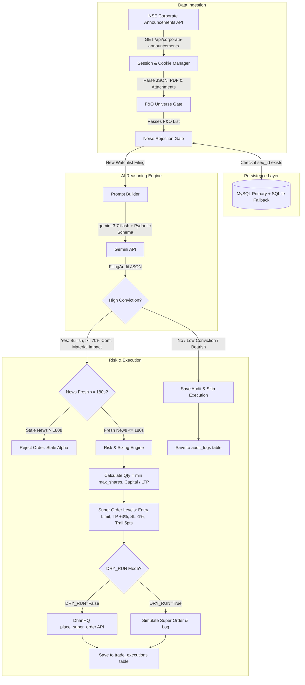

# 🟢 NSE News Catalyst AI Strategy

An event-driven algorithmic trading terminal for Indian Equities (**NSE & DhanHQ Broker**), utilizing **Google Gemini AI** for sub-second corporate announcement evaluation and automated execution of intraday **Super Orders** (bracket orders with target profit and stop-loss).

---

## 📑 Documentation Index

| Document | Description |
| :--- | :--- |
| **[README.md](file:///Users/amitdatta/Amit_Work/Trading_Work/Strategy_NSE_NEWS/strategy_dhan_nse_news/strategies/news_based_strategy/readme/README.md)** | Main strategy overview, architecture, signal pipeline & configuration |
| **[README_DOCKER.md](file:///Users/amitdatta/Amit_Work/Trading_Work/Strategy_NSE_NEWS/strategy_dhan_nse_news/strategies/news_based_strategy/readme/README_DOCKER.md)** | Container architecture, secret isolation, port configuration & docker helper script |
| **[README_GCP.md](file:///Users/amitdatta/Amit_Work/Trading_Work/Strategy_NSE_NEWS/strategy_dhan_nse_news/strategies/news_based_strategy/readme/README_GCP.md)** | GCP Compute Engine, Terraform IaC, automated market scheduling & remote log streams |

---

## 🏗️ End-to-End System Architecture



---

## ⚡ 4-Stage Signal Pipeline

### 1. Ingestion Layer (`ingestion/`)
* **Session & Cookie Priming**: Primes cookies against `https://www.nseindia.com` to bypass anti-scraping blocks.
* **F&O Universe Gate**: Resolves Dhan Security IDs and filters announcements against active F&O liquid equities.
* **Noise Filter**: 30+ regex filters discard compliance noise (trading window closures, investor meets, secretarial filings).
* **Bounded PDF Extractor**: Downloads attached disclosure PDFs (max 2 pages / 2 MB / 3s timeout) to supply full context to AI.

### 2. Intelligence Layer (`intelligence/`)
* **Model**: Google Gemini AI (`gemini-3.7-flash` / `gemini-2.5-flash`) at `temperature=0.0`.
* **Structured Output Schema**:
  - `sentiment`: `BULLISH` | `BEARISH` | `NEUTRAL`
  - `confidence`: `0` to `100` (Threshold: $\ge 70\%$)
  - `catalyst_type`: `ORDER_WIN`, `EARNINGS_BEAT`, `PENALTY`, etc.
  - `material_impact`: Boolean (True if estimated price impact $\ge 1.5\%$)
  - `summary`: 1-sentence concise explanation

### 3. Risk & Execution Layer (`execution/`)
* **Staleness Guard**: Rejects announcements older than `180 seconds` from exchange release.
* **DhanHQ Super Orders (Bracket Orders)**:
  - **Product**: `INTRADAY`
  - **Entry Limit**: $\text{LTP} \times 1.002$ (0.2% slippage buffer)
  - **Take Profit**: $\text{LTP} \times 1.03$ (+3.0%)
  - **Stop Loss**: $\text{LTP} \times 0.99$ (-1.0%)
  - **Trailing Stop**: 5.0 points

### 4. Storage & Persistence (`storage/`)
* **MySQL / MariaDB Primary**: Stores `processed_filings`, `audit_logs`, and `trade_executions`.
* **SQLite Fallback**: Activates automatically if MySQL is unreachable.

---

## 🌐 Web Dashboard & Interactive UI

The strategy includes a built-in FastAPI web dashboard (default port `8000`):
* **Live Telemetry & Status**: Monitor active mode (Dry-run vs Live), auto-order toggle, trade cut-off times, and square-off timers.
* **DhanHQ OAuth Login**: One-click Dhan login with automatic token persistence.
* **Live News Feed**: Stream real-time corporate filings with sentiment badges and AI reasoning summaries.
* **Trade Audit Log & History**: Inspect all executed bracket orders and paper trade triggers.
* **Filing Search & Simulation**: Search past filings and simulate feeds for offline testing.

---

## 🚀 Quick Start

### 1. Local CLI / GUI
```bash
cd strategies/news_based_strategy
pip install -r requirements.txt

# Run Web UI Dashboard on Port 8000
python3 -m news_based_strategy.main --gui --port 8000

# Run Pure CLI Terminal Poller
python3 -m news_based_strategy.main
```

### 2. Docker Execution
```bash
# Manage container using the helper script
./infra/scripts/docker.sh up -d --build
./infra/scripts/docker.sh logs
./infra/scripts/docker.sh down
```
*(For detailed Docker instructions, see [README_DOCKER.md](file:///Users/amitdatta/Amit_Work/Trading_Work/Strategy_NSE_NEWS/strategy_dhan_nse_news/strategies/news_based_strategy/readme/README_DOCKER.md)).*

### 3. GCP Deployment
```bash
# Fast code sync to existing GCP VM
./infra/scripts/deploy_code.sh

# Full Terraform provisioning from scratch
./infra/scripts/deploy.sh
```
*(For detailed GCP and cloud instructions, see [README_GCP.md](file:///Users/amitdatta/Amit_Work/Trading_Work/Strategy_NSE_NEWS/strategy_dhan_nse_news/strategies/news_based_strategy/readme/README_GCP.md)).*

---

## ⚙️ Configuration Reference (`.env`)

| Variable | Default | Description |
| :--- | :--- | :--- |
| `GEMINI_API_KEY` | `""` | Google Gemini API Key |
| `DHAN_CLIENT_ID` | `""` | Dhan Client ID |
| `DHAN_ACCESS_TOKEN` | `""` | Dhan Access Token |
| `DRY_RUN` | `true` | When `true`, simulates orders without hitting Dhan |
| `AUTO_ORDER` | `false` | When `true`, automatically places orders without manual confirmation |
| `MAX_SHARES_PER_TRADE` | `10` | Maximum share quantity per order |
| `TARGET_PROFIT_PCT` | `3.0` | Target profit percentage |
| `STOP_LOSS_PCT` | `1.0` | Stop loss percentage |
| `MAX_NEWS_AGE_SECONDS` | `180` | Staleness cutoff in seconds |

